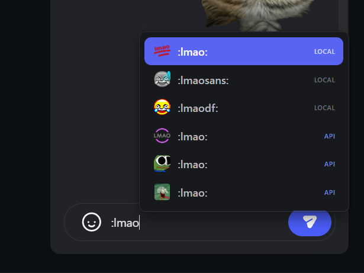
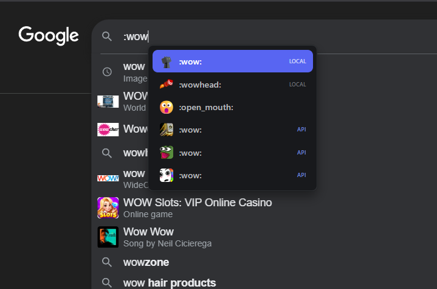

> [!TIP]
> Recommended: Download emojis locally for native support.

# Discordmoji - Discord-style Emoji Picker

A production-ready Chrome Extension (Manifest v3) that brings Discord-style emoji suggestions to any text input field on the web.

## Features

- Works in `<input>`, `<textarea>`, and `contenteditable` elements
- Triggered by typing `:` followed by emoji name
- Shows up to 30 relevant emoji suggestions
- Visual source indicators: "local" badge for discord-emojis.json, "api" badge for Discadia results
- Full keyboard navigation support:
  - `↑` / `↓` - Navigate suggestions
  - `Enter` or `Tab` - Select emoji
  - `Esc` - Close dropdown
- Mouse support - click any suggestion to select
- Dark modern UI with Discord-like styling
- Smart positioning near the caret
- Automatically repositions on scroll
- 5000+ local emojis plus thousands more from Discadia API
- Hybrid search combining local and online emoji databases
- Case-insensitive prefix matching
- API results cached for 5 minutes for performance
- Zero dependencies, no external CDN

## Architecture

### Modular Structure

```
discordmoji/
├── manifest.json                 # Manifest v3 configuration
├── data/
│   ├── emoji-data.json          # Unicode emoji database
│   └── discord-emojis.json      # 5000+ Discord-style emojis
├── src/
│   ├── background.js            # Service worker for API requests
│   ├── content.js               # Main controller
│   ├── utils/
│   │   ├── caret-position.js   # Caret position utilities
│   │   └── emoji-search.js     # Emoji search engine
│   ├── ui/
│   │   └── renderer.js         # UI rendering module
│   └── styles/
│       └── emoji-picker.css    # Dark theme styles
└── icons/
    ├── icon16.png
    ├── icon48.png
    └── icon128.png
```

### Core Modules

1. **background.js** - Service worker that handles Discadia API requests (bypasses CORS)
2. **caret-position.js** - Accurately determines caret position in various input types
3. **emoji-search.js** - Efficient emoji search with caching, API integration, and prioritized matching
4. **renderer.js** - Manages dropdown UI, positioning, and selection state
5. **content.js** - Main controller coordinating all modules and handling events

### Emoji Sources

The extension combines multiple emoji sources for comprehensive coverage:

1. **Local Database** - 5000+ emojis from `data/discord-emojis.json` and `data/emoji-data.json`
   - **Prioritized first** in all search results
   - Instant access with no network requests
   - Includes popular Discord emojis and unicode emojis
2. **Discadia API** - Live search against Discadia's extensive emoji library
   - API endpoint: `https://discadia.com/api/emojis`
   - Requests made via background service worker to bypass CORS restrictions
   - Results are cached for 5 minutes to minimize requests
   - **Used to fill remaining slots** after local results
   - Provides access to trending and community emojis

## Installation

### For Development

1. Clone or download this repository
2. Open Chrome and navigate to `chrome://extensions/`
3. Enable "Developer mode" (toggle in top right)
4. Click "Load unpacked"
5. Select the `discordmoji` folder
6. The extension is now installed and active

### For Production

1. Package the extension:
   - Zip the entire folder contents
   - Or use `chrome.exe --pack-extension=discordmoji`
2. Upload to Chrome Web Store

## Usage

1. Focus any text input field (input, textarea, or contenteditable)
2. Type `:` followed by an emoji name
3. A dropdown will appear with matching suggestions
4. Use keyboard arrows or mouse to select
5. Press Enter/Tab or click to insert the emoji
6. The `:query` text is replaced with the actual emoji

### Examples

- `:smile` → 😀
- `:heart` → ❤️
- `:fire` → 🔥
- `:rocket` → 🚀
- `:thinking` → 🤔

## Performance

- **Debounced input** - 150ms delay prevents excessive processing
- **Cached emoji data** - Loaded once and kept in memory
- **API caching** - Discadia API results cached for 5 minutes
- **Parallel search** - Local and API searches run simultaneously
- **Clean event listeners** - Properly attached/detached to prevent memory leaks
- **Efficient search** - Prioritized matching (exact → prefix → contains → keywords)
- **Deduplication** - Intelligent merging prevents duplicate results
- **Smooth animations** - CSS transitions for polished UX

## Browser Compatibility

- Chrome 88+ (Manifest v3 support)
- Edge 88+ (Chromium-based)
- Brave, Opera, and other Chromium browsers

## Customization

### Changing the Theme

Edit `src/styles/emoji-picker.css` to customize colors, sizes, and animations.

### Adding More Emojis

Edit `data/emoji-data.json` and add entries in this format:

```json
{
  "name": "emoji_name",
  "unicode": "🎉",
  "keywords": ["keyword1", "keyword2", "keyword3"]
}
```

### Adjusting Max Results

In `src/content.js`, change the search limit:

```javascript
const emojis = await searchEmojis(query, 6); // Change 6 to your desired limit
```

## Code Quality

- Modern ES6+ JavaScript
- Clear separation of concerns
- Comprehensive comments
- No global pollution
- Proper error handling
- Production-ready structure

## License

MIT License - Feel free to use and modify as needed.

## Contributing

Contributions are welcome! Please ensure:

- Code follows existing style
- Comments explain complex logic
- No external dependencies added
- Testing on multiple sites

## Troubleshooting

### Dropdown not appearing

- Check browser console for errors
- Ensure emoji-data.json is loading correctly
- Verify the site doesn't prevent extension scripts

### Position is incorrect

- Some sites use CSS transforms that affect positioning
- The caret-position utility handles most cases

### Emojis not inserted correctly

- contenteditable elements vary by implementation
- Report specific sites with issues

## Future Enhancements

- Custom emoji support
- Emoji categories
- Recent/favorites
- Skin tone selection
- Configurable trigger character
- Import/export emoji sets
